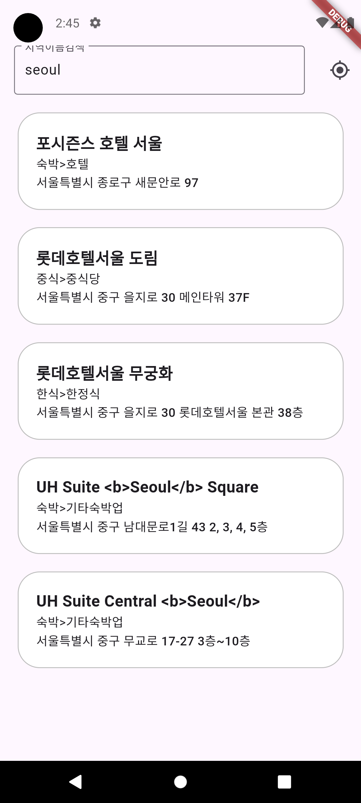
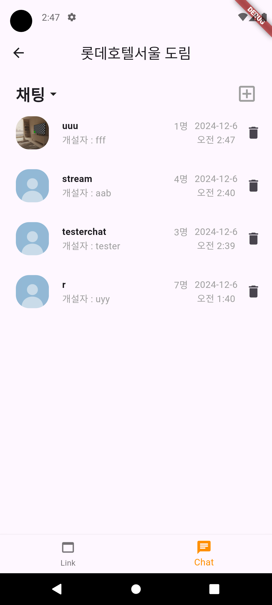
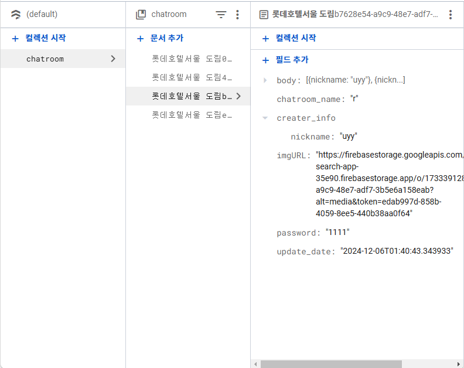
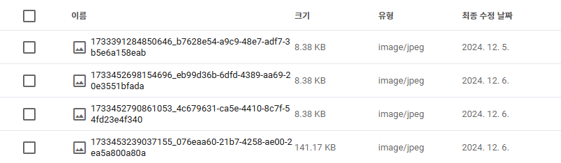

# Local Search App
개인 과제 - 지역 검색 앱

## 프로젝트 소개
아래의 기능들이 있는 지역 겁색 앱

## 실행 영상
[[프로젝트 실행 영상]](https://youtu.be/ZQXuXfshiL8)

 

| HomePage | DetailPage(1) | DetailPage(2) | ChatPage |
| --- | --- | --- | --- |
|  |  |  |  |

 

| Firebase DB | Storage | Realtime DB |
| --- | --- | --- |
|  |  |  |

 

< 필수 기능 > 
1. HomePage 구현
2. 지역 검색 기능 구현

< 도전 기능 >
1. 현재 위치 조회 후 네이버 API로 검색
2. 나만의 기능 추가
    
## 적용 기능
#### < 필수 기능 >
>* HomePage 구현 : 
 지역을 검색할 수 있는 HomePage 초기 화면 구현  
>* 지역 검색 기능 구현 : 
 TextField에 값을 입력후 Submit 하면 네이버 API를 통해 검색값을 받아오는 기능 구현 + 박스 누를시 해당 link가 연결되어 있는 Detailpage 구현  
#### < 도전 기능 >
>* 현재 위치 조회 후 네이버 API로 검색 :
 HomePage의 IconButton을 누르면, 현재 기기의 위치정보를 받은 후, 해당 위치정보를 기반으로 네이버 API에서 검색을 실시하는 로직 구현  
#### < 자유 구현 >
>* UX - 검색을 할때, 검색중 or 검색결과 없음이 출력되도록 하기 : 
 검색을 시작했을때, 로딩 Indicator가 보이도록하고 TextField를 누를 수 없도록 잠구기, 만일 검색값이 없는경우 '검색결과가 없습니다' 같은 문구를 출력함  
>* 장소 채팅방 (Firebase DB + Storage): 
 각 지역의 장소마다 채팅방을 만들어 서로 채팅할 수 있는 채팅방 기능 구현.  채팅방 대문 이미지, 채팅방 이름, 개설자 닉네임, 채팅방 비밀번호를 설정하면 채팅방을 만들 수 있다.  각 채팅방의 정보는 파이어베이스 DB에 저장되며, 대문 이미지는 Storage에 저장된다.  채팅방을 삭제할때는 만들었을때의 비밀번호를 입력해야 한다. 삭제시 DB, Stroage의 데이터까지 삭제된다.  
>* 채팅창 (Firebase Realtime DB) : 
 각 채팅방 마다 채팅할 수 있는 채팅창 구현. 닉네임을 설정하여 채팅하는 방식으로, 닉네임을 확정해 놓고 채팅해야 한다.각 채팅 정보는 Realtime DB에 저장되며, 채팅방이 삭제되면 같이 삭제된다.  채팅을 하면, 최신 update_date가 업데이트되며, 채팅방내 채팅인원수(닉네임 개수)등이 업데이트 된다.  업데이트는 Firebase DB, Realitime DB 둘다 같이 적용된다. 

## 🚨 Trouble Shooting

📚[ RiverPod 메서드 작동부분 ]

### [ TIL - RiverPod 메서드 작동 ](https://hamiric.tistory.com/70)

  

📝[ 파이어베이스 TimeStamp 사용할건가요? ]

### [ TIL - 파이어베이스 TimeStamp 사용법과 대체방법 ](https://hamiric.tistory.com/76)

  

🎉[ AlertDialog의 SetState 작동방식 / 파이어베이스 스토리지에 에셋 이미지 저장방법 ]

### [ TIL - AlertDialog의 SetState 작동방식 / 파이어베이스 스토리지에 에셋 이미지 저장방법 ](https://hamiric.tistory.com/77)

  

🚀[ 파이어베이스 업데이트 심화 ]

### [ TIL - 파이어베이스 업데이트시, 하위 데이터를 업데이트 하는 방법 ](https://hamiric.tistory.com/78)

  

👽️[ 파이어베이스가 제공하는 2가지 DB인 Firebase DB와 Realtime DB 의 차이점과 각각의 사용법 ]

### [ TIL - Firebase DB 와 Realtime DB 의 차이점과 사용법 ](https://hamiric.tistory.com/70)

  

## 📝Technologies & Tools (FE)

| 기술스택 | 배지 |
| --- | --- |
| Language |  |
| Framework |  |
| Code Editor |  |
| Library |        |
| Version Control |   |